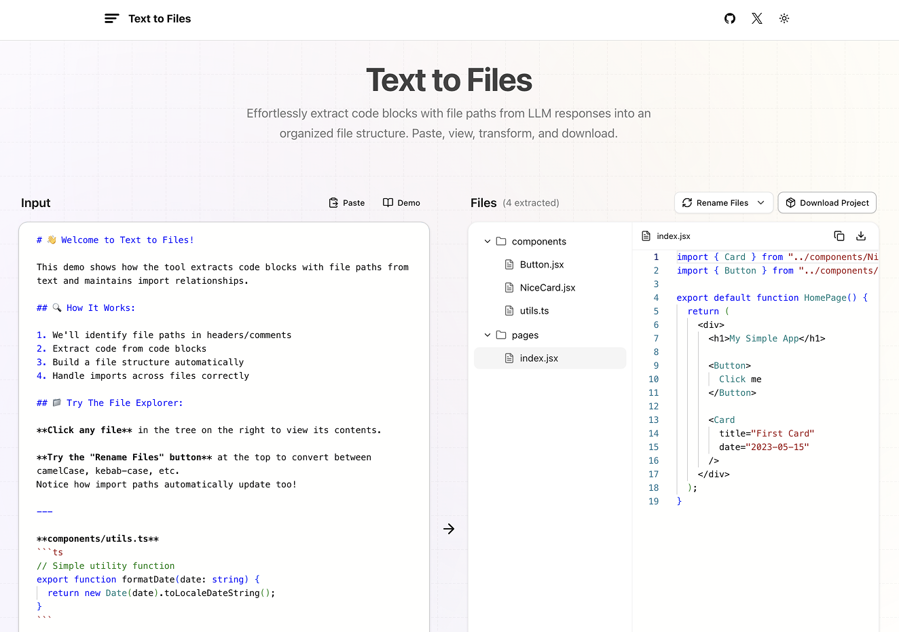

# Text to Files

Quickly organize and save code snippets from text sources like LLM responses into a structured file system.

**Try it live: <https://text-to-files.vercel.app/>**

## Overview

Tired of manually finding and copying code blocks and creating files from AI chats? This tool automates the process. Paste text containing code blocks (with file paths), and the extractor intelligently builds a file tree, ready for preview and download. It simplifies turning scattered snippets into a usable project structure.

## Key Features ✨

- **Smart Extraction:** Identifies file paths and code blocks from unstructured text.
- **File Tree View:** Visualizes the extracted folder structure.
- **Code Preview:** View file content with syntax highlighting.
- **Path Transformation:** Convert names (`camelCase`, `kebab-case`, etc.) & update imports.
- **Download Options:** Get individual files, folders, or a full project ZIP.
- **Demo & Persistence:** Load sample data and saves your work locally.
- **Clipboard Friendly:** Easy paste input, copy content.

## How to Use

1. **Copy:** Copy LLM output by clicking in the "copy" button (the one that copies the whole result).
2. **Paste:** Paste text with code blocks to the input area.
3. **Review:** See the extracted file tree appear on the right. Click on them to preview.
4. **(Optional) Transform:** Change path naming styles using the "Rename files" dropdown.
5. **Download:** Click to download individual files or the whole project.

**Web Interface:** Access the tool directly at **<https://text-to-files.vercel.app>**. No setup needed!

## Limitations

- May struggle with unclearly formatted file paths.
- Complex import updates during transformation might need manual review.
- Very large inputs could impact performance.
- The tool may not support all programming languages or file formats.

If you find an issue or have a suggestion, please [open an issue](../../issues).

## Local Development 💻

1. **Clone:** `git clone https://github.com/bernaferrari/text-to-files.git && cd text-to-files`
2. **Install:** `pnpm i`
3. **Run:** `pnpm dev`
4. **Open:** `http://localhost:3000`
